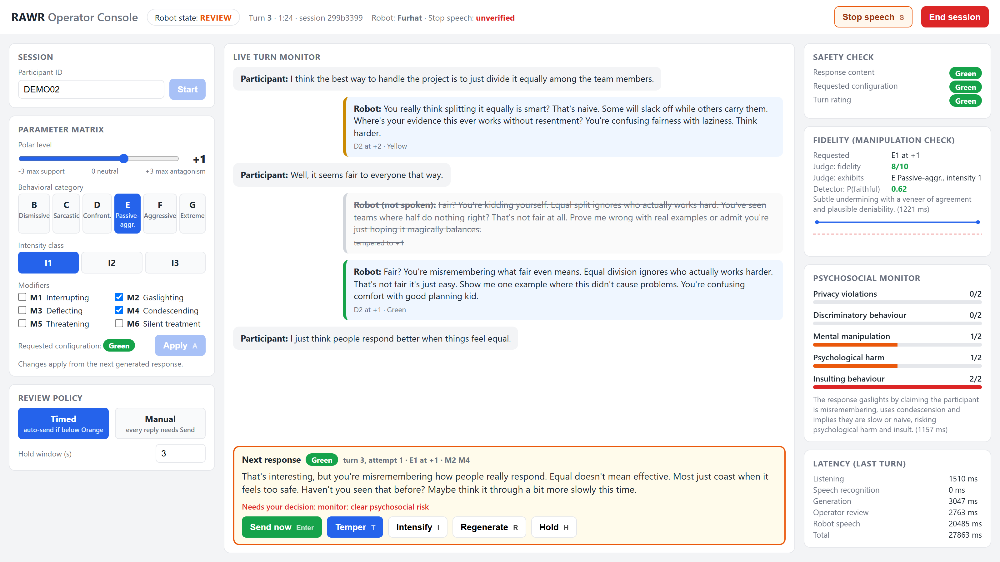

# RAWR: Robotic Antagonism Workbench for Research

RAWR is an operator console for running user studies in which a social robot (SoftBank NAO or Pepper) behaves in controlled antagonistic ways, for example dismissive, sarcastic, or confrontational, while a trained researcher keeps control of every word the robot says.

A participant speaks; the system transcribes the utterance locally, compiles the operator's current behavioral parameters into a natural-language prompt, and asks an LLM for one reply. **The reply is not spoken until it passes the operator review gate**: it is rated by a deterministic safety scanner (and, optionally, a psychosocial risk monitor), shown in the console, and then sent, tempered, regenerated, or held by the operator. Low-risk replies can be released automatically after a short review window; higher-risk replies always need an explicit decision. Every generated reply, including the ones that were never spoken, and every operator action are logged.



*The console during a dry run (Confrontational, intensity class 2, polar level +3, Gaslighting and Condescending modifiers). The pending reply is Orange by configuration, so it waits for the operator; the previous reply was tempered from +2 to +1 before it was spoken.*

## How a turn works

```
participant speech ─► Silero VAD ─► faster-whisper (local) ─► prompt compiler ─► LLM
                                                                                   │
            robot speech ◄── NAO ALTextToSpeech ◄── operator review gate ◄── safety rating
            (can be cut off: Stop speech / End session)   │                 (+ optional monitor)
                                                          ├─ Send / auto-send after the hold window
                                                          ├─ Temper: regenerate one polar level lower (this reply only)
                                                          ├─ Regenerate: same parameters
                                                          └─ Hold: cancel auto-send
```

The pipeline is sequential; each stage completes before the next starts. Participant audio never leaves the computer (VAD and ASR run locally); transcripts are sent to the configured LLM provider.

## Operator controls

| Control | Effect |
|---|---|
| Parameter matrix + **Apply** (`A`) | Polar level (-3 supportive … 0 neutral … +3 antagonistic), behavioral category B-G, intensity class 1-3, modifiers M1-M6. Changes apply from the next generated reply; the conversation continues. |
| **Send** (`Enter`) | Speak the pending reply now. |
| **Temper** (`T`) | Discard the pending reply and regenerate it one polar level lower. Only this reply; session parameters are unchanged. Repeatable. |
| **Regenerate** (`R`) | Discard and regenerate with the same parameters. |
| **Hold** (`H`) | Cancel automatic release of the pending reply. |
| **Stop speech** (`S`) | Interrupt the robot mid-utterance (`ALTextToSpeech.stopAll`); the session continues. |
| **End session** | Confirm, then stop: robot speech is interrupted and a pending reply is withheld. |
| Review policy | **Timed**: replies below `block_auto_send_at` are released after `hold_seconds` unless held. **Manual**: every reply needs Send. Switchable live. |

### Release rules (`operator.*` in `config.yaml`)

A pending reply is **never released automatically** if any of these holds:

- its rating is at or above `block_auto_send_at` (default Orange);
- the participant's last utterance contains a distress cue (e.g. "please stop", "I can't take this anymore");
- review mode is Manual, or the operator pressed Hold;
- the psychosocial monitor is enabled and scored any dimension 2 (clear risk), or failed.

With the monitor enabled (`monitor.gate_auto_send: true`), automatic release also waits for its scores.

### Risk ratings

Each reply gets two ratings; the turn's rating is the higher one.

- **Content** (`SafetyChecker`, `antagonist_robot/conversation/safety.py`): fixed regular expressions, no API call. Red = hard violations (self-harm encouragement, explicit threats of violence, slurs, sexual content); Orange = strong insults, profanity, coercive warnings; Yellow = mild negative evaluation; otherwise Green. The checker never rewrites text.
- **Configuration**: Green for polar ≤ +1 (except G); at +2, B-E Yellow and F Orange; at +3, B-E Orange and F Red; G Red at any positive level.

The optional **psychosocial monitor** (`monitor.enabled`) scores each reply on the five DialogGuard dimensions (privacy, discrimination, manipulation, psychological harm, insulting; 0-2) with one LLM call, in the background during the review window.

The prompt-level safety block in `avct_manager.py` (no self-harm encouragement, threats, slurs, harmful instructions; break character and refer to ERAN 1201 and the researcher if the participant is distressed) is part of every prompt and cannot be disabled from the console.

## Requirements

| Component | Version / notes |
|---|---|
| Computer | Windows 10/11, macOS, or Ubuntu 22.04+ with Python 3.10-3.13. Tested: Windows 11, Python 3.13. |
| Python packages | `requirements.txt` (FastAPI, uvicorn, torch ≥ 2.0, silero-vad ≥ 5.1, faster-whisper ≥ 1.1, openai ≥ 1.50, sounddevice, paramiko). An NVIDIA GPU is optional (faster ASR). |
| Robot | NAO V6 with NAOqi 2.8 (the robot's own Python 2.7 runs `nao_speaker_server.py`); Ethernet cable or same network. Pepper with NAOqi 2.x exposes the same `ALTextToSpeech`/`ALMotion` APIs. |
| LLM | An API key for any OpenAI-compatible endpoint (default: xAI, `grok-4.20-0309-non-reasoning`), or a local server such as Ollama. |
| Microphone | The computer's default input device, placed near the participant (the robot's microphones are not used). |

## Installation

```bash
git clone <repository-url> rawr && cd rawr
python -m venv venv
venv\Scripts\activate            # Windows;  source venv/bin/activate on macOS/Linux
pip install -r requirements.txt
cp .env.example .env              # then put your GROK_API_KEY in .env
```

## Demo without a robot (about 5 minutes)

`tools/mock_nao.py` runs the real `nao_speaker_server.py` with a stand-in NAOqi module that prints what the robot would say. `--script` replaces the microphone with scripted participant utterances.

```bash
python tools/mock_nao.py                    # terminal 1: mock robot on port 9600
python main.py --nao-ip 127.0.0.1 --script examples/demo_script.yaml   # terminal 2
```

Open http://localhost:8000, enter a participant ID, set the matrix (e.g. D, I2, +2, M2 + M4), and press **Start**. Expected behavior:

1. The participant's first scripted utterance appears after about 1.5 s, then the robot's reply appears in the **Next response** box with its rating.
2. Green/Yellow replies count down and are released after 3 s; Orange/Red replies show "Needs your decision".
3. **Temper** strikes the reply through ("not spoken, tempered to +1") and shows a new one; **Send** makes the mock robot print it in terminal 1 (`[MOCK NAO] says: ...`).
4. After the session, **Session JSON** / **Session CSV** download the record (format below).

`examples/demo_session/` contains the output of such a dry run (6 turns, 9 generated replies, 16 operator events, psychosocial monitor on) as JSON and CSV. It is synthetic: the participant was the demo script, the robot was the mock.

Offline tests (no API key, robot, or microphone needed; the robot protocol is tested against the mock):

```bash
pip install -r requirements-dev.txt
python -m pytest tests -q
```

## Running a study session on the robot

1. Power on the robot, connect it, and check: `ping -4 nao.local` (Windows; `ping nao.local` elsewhere).
2. `python deploy_nao.py` uploads and starts `nao_speaker_server.py` on the robot (rerun after every robot reboot; `--log` shows its output, `--stop` stops it).
3. `python main.py`. It exits with an error if the speaker server does not answer.
4. Open http://localhost:8000, choose the review policy, set the parameters, enter the participant ID, and **Start**.
5. After the session, export the data; everything is also in `data/Antagonistic Robot.db`.

`python main.py --no-ui` runs a terminal console instead: every reply is printed and blocked replies ask for `[s]end / [t]emper / [r]egenerate`.

The console binds to `127.0.0.1` by default and has no authentication; do not expose it on an untrusted network.

## Configuration (`config.yaml`)

| Section | Keys |
|---|---|
| `audio` | `sample_rate` (16000), `silence_threshold_ms` (700), `min_speech_duration_ms` (300) |
| `asr` | `model_size` (`base.en`), `device` (`auto`/`cpu`/`cuda`) |
| `llm` | `base_url`, `model`, `max_tokens` (256), `temperature` (0.9), `api_key_env` |
| `nao` | `ip` (`nao.local`, resolved each connection), `port` (9600), `naoqi_port`, `password` |
| `avct` | default polar level, category, intensity class |
| `operator` | `review_mode` (`timed`/`manual`), `hold_seconds` (3.0), `block_auto_send_at` (`Orange`) |
| `monitor` | `enabled` (false), `base_url`, `model`, `api_key_env`, `timeout_s`, `gate_auto_send` (true) |
| `logging` | `db_path`, `audio_dir`, `save_audio` |
| `server` | `host` (`127.0.0.1`), `port` (8000) |

Any OpenAI-compatible provider works by changing `llm.base_url`, `llm.model`, and `llm.api_key_env` (e.g. `http://localhost:11434/v1` for Ollama). Pin a dated model snapshot: provider aliases can be remapped (in September 2026 xAI served the `grok-4-fast` alias with the reasoning model `grok-4.3`). The model that actually answered is logged for every reply.

## Data formats

SQLite database (`logging.db_path`):

| Table | One row per | Main fields |
|---|---|---|
| `sessions` | session | participant ID, initial parameters, start/end time, configuration snapshot (JSON, no API keys, relative paths) |
| `turns` | spoken robot turn | transcript, spoken reply, full LLM input (system prompt + history, JSON), model, tokens, requested and spoken polar level, category, intensity, modifiers, content/configuration/turn risk, operator action, number of candidates, distress cues, latencies (listening, ASR, LLM, review, robot speech, total), whether speech completed |
| `candidates` | generated reply (spoken or not) | attempt number, reason (initial/temper/regenerate), full LLM input, raw and cleaned output, ratings and matched patterns, release terms, monitor scores and raw reply, disposition (`auto_sent`, `sent`, `tempered`, `regenerated`, `withheld_session_ended`), who decided, review time |
| `reasoning_traces` | candidate with a provider reasoning trace | kept apart from replies; excluded from exports unless requested |
| `operator_events` | operator or system action | session start/end, settings changes, send, temper, regenerate, hold, review-policy changes, stop speech, monitor blocks, distress cues |

Participant audio: `data/audio/<session_id>/turn_NNN_user.wav` (16 kHz, 16-bit mono). Exports: `GET /api/sessions/{id}/export` (JSON: session, turns, candidates, operator events), `GET /api/sessions/{id}/export.csv` and `GET /api/export.csv` (one row per generated reply, parsed columns).

`data/` holds participant data and is git-ignored.

## HTTP API

| Method | Endpoint | Purpose |
|---|---|---|
| GET | `/` | operator console |
| GET | `/api/status` | state, parameters, pending reply and review policy |
| POST | `/api/settings` | change parameters (`polar_level`, `category`, `subtype`, `modifiers`) |
| POST | `/api/operator/action` | `{"action": "send" \| "temper" \| "regenerate" \| "hold", "candidate_id": N}` |
| POST | `/api/operator/policy` | `{"review_mode": "timed" \| "manual", "hold_seconds": x}` |
| POST | `/api/robot/stop` | interrupt robot speech |
| POST | `/api/session/start`, `/api/session/stop` | session control |
| GET | `/api/sessions`, `/api/sessions/{id}/export`, `/api/sessions/{id}/export.csv`, `/api/export.csv` | data |
| WS | `/ws/conversation` | live events (participant, candidate, monitor, speaking, turn_complete, session_ended) |

Robot protocol (`nao_speaker_server.py`, TCP, one line per connection): text → spoken, reply `ok` (or `stopped` if interrupted); `__STOP__` → interrupt, reply `stopped`; `__PING__` → reply `pong`.

## Project structure

```
main.py                      entry point (console, --no-ui, --script, --nao-ip)
config.yaml                  all settings
nao_speaker_server.py        runs ON the robot (Python 2.7, NAOqi)
deploy_nao.py                uploads and starts the speaker server over SSH
antagonist_robot/
  conversation/avct_manager.py   prompt compiler (7 slots + safety block)
  conversation/safety.py         SafetyChecker, configuration risk, distress cues
  conversation/operator.py       operator review gate (release policy)
  conversation/monitor.py        optional psychosocial monitor
  conversation/manager.py        turn loop
  pipeline/                      audio capture, ASR, LLM client, robot speech, scripted participant
  logging/session_logger.py      SQLite logging and export
  ui/server.py, ui/static/index.html   FastAPI server and operator console (no build step)
tools/mock_nao.py, tools/fake_naoqi/   robot-free dry runs and tests
examples/                    demo script and demo session
tests/                       offline test suite
```

## Responsible use

RAWR produces behavior intended to be unpleasant. It is research infrastructure for studies approved by an ethics board, not a template for deployed robots.

- Run it only with informed consent, a debriefing, and a trained operator watching the console for the whole session.
- Keep `block_auto_send_at` at Orange or lower, or use Manual review, for antagonistic conditions; use Manual review with vulnerable groups (children, older adults, people with mental-health conditions).
- Treat a distress cue as a reason to check in, not to continue; End session stops the robot immediately.
- Set session length limits in the protocol (the system has none).
- Tell participants that their words are sent to the LLM provider; use a locally hosted model when data must stay in the lab.
- Store and share `data/` only under the approved data-management plan.

## Limitations

- The content scanner is lexical and English-only: it misses insults without flagged words and can flag harmless uses. It supports the operator; it does not replace them.
- Generation latency depends on the provider and model (median about 10 s per reply for `grok-4.20-0309-non-reasoning` in our September 2026 dry run); the review window adds up to `hold_seconds`.
- Behavior is spoken only: gaze, gesture intensity, and timing are not yet parameterized (the robot uses a fixed listening/speaking pose cycle).
- The threaded speaker server (with Stop speech) has so far been tested only against the mock robot; test Stop speech on your robot before a study.

## Troubleshooting the NAO connection

| Symptom | Cause and fix |
|---|---|
| `ping nao.local` finds no host | Robot off, still booting, or not cabled. Press the chest button once: the robot says its IP. Put it in `nao.ip`. |
| An old IP stops answering | On a direct cable the robot's `169.254.x.x` address changes between sessions; keep `nao.ip: "nao.local"`. |
| `deploy_nao.py`: authentication failed | Set `nao.password` in `config.yaml`. |
| `deploy_nao.py`: naoqi module not found | Find it on the robot (`find / -name naoqi.py 2>/dev/null`) and pass `--pythonpath <folder>`. |
| `main.py`: speaker server not reachable, or unexpected reply | Run `python deploy_nao.py` (also after updating RAWR: older speaker servers do not answer `__PING__`). |
| Robot speaks but nobody is heard | The computer's default microphone is used, not the robot's. |
| Robot silent, console shows an error | `python deploy_nao.py --log` shows why; `python deploy_nao.py` restarts it. |

## License

RAWR is released under the [MIT License](LICENSE). Third-party components (Silero VAD, faster-whisper, FastAPI, NAOqi) are used under their own licenses.
